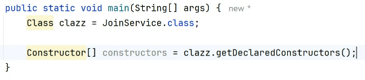
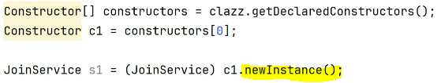
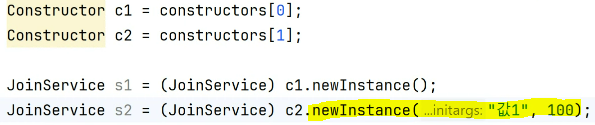
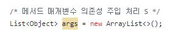
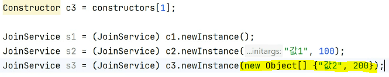
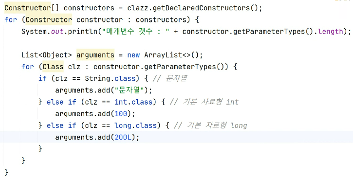
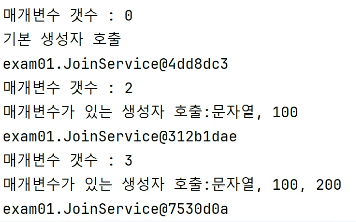

# 실무프로젝트 p-3

BeanContainer.java

---
- 객체 조립기, 객체 자동 스캔 및 생성
- 스캔 방법은 애노테이션 - @Controller, @RestController, @Component, @Service이 있으면 객체 생성

### @Controller: 요청시 유입되는 컨트롤러
- 출력: jsp 형태
### @RestController: 요청시 유입되는 컨트롤러
- 출력: json 형태 {이름, 값}

DispatcherServlet: 모든 요청과 응답의 창구
- URL 패턴 : `/`

### HandlerMapping 인터페이스, 구현체: HandlerMappingImpl
- 요청 주소와 요청 방식(Method - GET, POST, PATCH, PUT, DELETE) 정보를 가지고 컨트롤러 객체(@Controller, @RestController)와 요청 메서드를 찾아주는 역할

```
@Controller
@RequestMapping("/member")
public class MemberController {
...
    @GetMapping("/join")
    public String join(RequestJoin form) {
        ...
    }
}
- GET /member/join

@Controller
public class MemberController {
...
    @GetMapping("/join")
    public String join(RequestJoin form) {
        ...
    }
}
- GET /member/join
```
### HandlerAdapter 인터페이스 , 구현체: HandlerAdapterImpl
- 찾은 컨트롤러 객체의 메서드를 실행
- 요청 메서드에 정의된 매개변수 유형에 따라 요청 데이터를 자료형에 맞게 자동 주입해주고 실행한다
- 서블릿 기본 객체도 매개변수에 정의되어 있으면 자동주입(HttpServletRequest, HttpServletResponse, HttpSession)

### 객체 관리의 자동화
-> Reflection API

`__강의 오후 3시 40분__`
- <span style="background-color:yellow">동적 객체 생성</span>, 동적 메서드 호출, 동적 변수 값 변경을 할 수 있음

- Class 클래스
  - 각 구성 요소인 Constructor 객체, Method 객체, Field 객체...
  - 동적으로 객체를 생성할 수 있는 자원들이 다 담겨있다.
  - Constructor[] Constructors: public 생성자 메서드만 조회
  - Constructor[] getDeclaredConstructors(): 모든 범위의 생성자(접근제어자와 상관없이)
    

- newInstance(Object... initargs) -> 동적 객체생성/ 매개변수 가변인수 형태
  - 기본생성자 객체생성 예시<br>
  
  - 매개변수 있는 생성자 객체생성 예시<br>
  
  - 보통 세번째 객체 생성 형태를 자주 쓰는데 동적으로 매개변수를 넣기 위해 List형태로 선언한후 가장 상위 객체인 Object 배열 객체로 인수 넣어준다.<br>
    (예시)
  - 배열 객체 형태로 넣어도 값이 투입됨<br>
  - 가공한 후 값을 배열형태로 넣어도 객체 생성 가능
  

생성자의 매개변수가 몇갠지 알 수 없을때
getParameterTypes()사용해서 개수를 알 수 있다.



리스트 형태를 배열로 바꿔야한다.
```java
public class JoinService {
    public JoinService() {
        System.out.println("기본 생성자 호출");
    }

    public JoinService(String arg1, int arg2) {
        System.out.printf("매개변수가 있는 생성자 호출:%s, %d%n", arg1, arg2);
    }

    public JoinService(String arg1, int arg2, long arg3) {
        System.out.printf("매개변수가 있는 생성자 호출:%s, %d, %d%n", arg1, arg2, arg3);
    }
}
```
```java
public class Ex01 {
  public static void main(String[] args) throws Exception {
    Class clazz = JoinService.class;

    Constructor[] constructors = clazz.getDeclaredConstructors();
    for (Constructor constructor : constructors) {
      System.out.println("매개변수 갯수 : " + constructor.getParameterTypes().length);

      List<Object> arguments = new ArrayList<>();
      for (Class clz : constructor.getParameterTypes()) {
        if (clz == String.class) { // 문자열
          arguments.add("문자열");
        } else if (clz == int.class) { // 기본 자료형 int
          arguments.add(100);
        } else if (clz == long.class) { // 기본 자료형 long
          arguments.add(200L);
        }
      }

      Object obj = arguments.isEmpty()
              ?constructor.newInstance()
              :
              constructor.newInstance(arguments.toArray());

      JoinService service = (JoinService) obj;
      System.out.println(service);
    }


        /*
        Constructor c1 = constructors[0];
        Constructor c2 = constructors[1];
        Constructor c3 = constructors[1];

        JoinService s1 = (JoinService) c1.newInstance();
        JoinService s2 = (JoinService) c2.newInstance("값1", 100);
        JoinService s3 = (JoinService) c3.newInstance(new Object[] {"값2", 200, 300});

        /*
        for (Constructor constructor : constructors) {
            System.out.println(constructor);
        }

         */
  }
}
```


---
Method 클래스 <br>
- Object invoke(Object obj, Object... args) : 동적으로 메서드를 호출해줌

- String getName(): 메서드 이름 반환

```java
//Member클래스
package exam02;

import java.time.LocalDateTime;

public class Member {
  private String userId;
  private String email;
  private LocalDateTime regDt;

  public final String str = "ABC";

  public String getUserId() {
    return userId;
  }

  public void setUserId(String userId) {
    this.userId = userId;
  }

  public String getEmail() {
    return email;
  }

  public void setEmail(String email) {
    this.email = email;
  }

  public LocalDateTime getRegDt() {
    return regDt;
  }

  public void setRegDt(LocalDateTime regDt) {
    this.regDt = regDt;
  }

  @Override
  public String toString() {
    return "Member{" +
            "userId='" + userId + '\'' +
            ", email='" + email + '\'' +
            ", regDt=" + regDt + '\'' +
            ", str='" + str +
            '}';
  }
}
```
```java
//Ex01클래스
package exam02;

import java.lang.reflect.Constructor;
import java.lang.reflect.Method;
import java.time.LocalDateTime;

public class Ex01 {
  public static void main(String[] args) throws Exception {
    Class clazz = Member.class; //Member클래스의 Class객체를 가져온다.

    Constructor constructor = clazz.getDeclaredConstructors()[0]; //Member 클래스의 첫 번째 생성자를 가져온다.
    Object obj = constructor.newInstance(); //가져온 생성자를 사용하여 Member 객체를 생성합니다.

    Method[] methods = clazz.getDeclaredMethods(); //Member 클래스의 모든 메서드를 가져옵니다.
    for (Method method : methods) { //각 메서드 반복
      String name = method.getName();
      if (!name.startsWith("set")) {
        continue; //메서드 이름이 "set"으로 시작하지 않으면 건너뛴다.
        //다시 메서드 이름 찾으러 ~
      }

      Class clz = method.getParameterTypes()[0];
      Object arg = null;
      if (clz == String.class) { // setter 메서드의 매개변수가 문자열
        arg = "문자열";
      } else if (clz == LocalDateTime.class) { // setter 메서드의 매개변수가 LocalDateTime
        arg = LocalDateTime.now();
      }

      method.invoke(obj, arg); // setter 메서드 호출
    }

    System.out.println(obj);
  }
}
```
---
getDeclaredFields(): 전체 멤버변수 가져옴

set(Object obj, Object value): 지정된 개체 인수에서 이 개체가 나타내는 필드를 Field지정된 새 값으로 설정할수있다.
```java
//Ex02클래스
package exam02;

import java.lang.reflect.Constructor;
import java.lang.reflect.Field;

public class Ex02 {
  public static void main(String[] args) throws Exception {
    Class clazz = Member.class;
    Constructor constructor = clazz.getDeclaredConstructors()[0];
    Object obj = constructor.newInstance();

    Field field = clazz.getDeclaredField("str");
    field.setAccessible(true);
    System.out.println(field);
    field.set(obj, "DEF");

    Member member = (Member)obj;
    System.out.println(member.str);
  }
}
```
